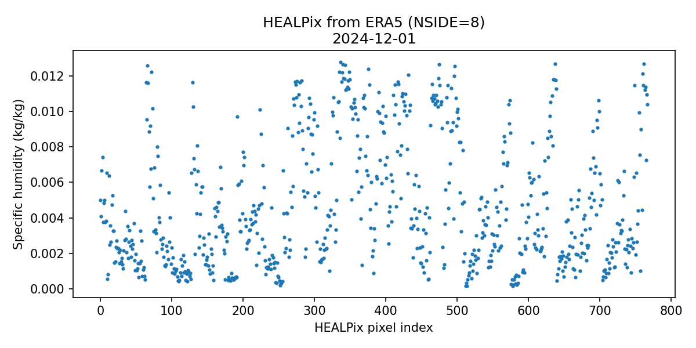
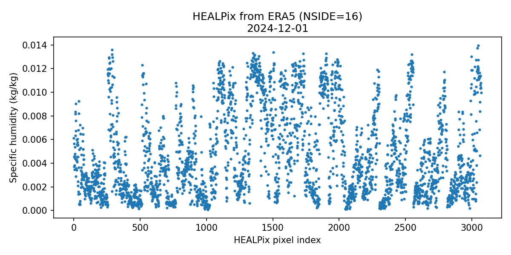

## Homework 2  
**Earth System Data Processing (ESDP)**  

**Author:** Gaurav Somani  
**Course:** Earth System Data Processing  
**Semester:** Winter Semester 2024/25  

---

### 1. Introduction and Objective

The goal of this homework is to design a **reproducible data-processing pipeline** that:

- programmatically downloads ERA5 reanalysis data,
- processes the data into a reduced spatial representation (HEALPix),
- stores the processed output efficiently using Zarr,
- and produces meaningful visualizations.

---

### 2. Initial Setup: CDS Account and API Configuration

The first step was setting up access to the **Copernicus Climate Data Store (CDS)**, which provides programmatic access to ERA5 reanalysis data.

#### 2.1 Creating a CDS Account

A user account was created on the Copernicus Climate Data Store website:

- https://cds.climate.copernicus.eu/

After logging in, an API key was generated from the user profile page:

- https://cds.climate.copernicus.eu/api-how-to

This API key allows authenticated access to the CDS servers from Python.

---

#### 2.2 Storing the CDS API Key

The API credentials were stored locally in a configuration file named `.cdsapirc`, following the official CDS instructions.

The file was created using a text editor and saved in the user home directory.

Example content of the `.cdsapirc` file:

```text
url: https://cds.climate.copernicus.eu/api/v2
key: <UID>:<API_KEY>
```
---

### 3. ERA5 Data Download Using the CDS API

ERA5 data is downloaded programmatically using the **Copernicus Climate Data Store (CDS) API**.  
This approach avoids manual downloads and ensures that the workflow is fully reproducible.

#### 3.1 Installing the CDS API Client

The Python client for accessing CDS was installed using `pip`:

```bash
pip install cdsapi
```
#### 3.2 Programmatic ERA5 Download Using cdsapi

ERA5 pressure-level data is downloaded inside a Python script using the CDS API client.

An example download request used in this homework is shown below:
```python
import cdsapi

c = cdsapi.Client()

c.retrieve(
    "reanalysis-era5-pressure-levels",
    {
        "product_type": "reanalysis",
        "variable": "specific_humidity",
        "pressure_level": [
            "975", "900", "800", "500", "300"
        ],
        "year": "2024",
        "month": "12",
        "day": "01",
        "time": [
            "00:00", "06:00", "12:00", "18:00"
        ],
        "format": "netcdf",
    },
    "era5_20241201.nc"
)
```

---

## 4. Understanding the Workflow Using a Notebook

Before implementing the full automated pipeline, a **Jupyter notebook** (one-day-era5-to-healpix.ipynb) was used for exploratory analysis and conceptual understanding.

The notebook was used to:

- inspect the structure of ERA5 NetCDF files,
- understand how **specific humidity** is stored across dimensions,
- examine latitude–longitude grid conventions,
- and experiment with HEALPix regridding using small, controlled examples.

This step was important to ensure that the later pipeline logic was correct and that no assumptions were made blindly.

The notebook was used **only for exploration and debugging** and is not part of the final automated workflow.  
All production logic was later moved into standalone Python scripts inside the `src/` directory.

During the exploratory phase, an error was encountered when attempting to reopen a Zarr store using `xarray.open_zarr` on **Python 3.11 (Windows)**.  
The exact error observed in the notebook is shown below:

```text
AttributeError                            Traceback (most recent call last)
Cell In[17], line 1
----> 1 xr.open_zarr(DATA_DIR / "era5_hp8_one_day.zarr")

File ... xarray/backends/zarr.py
...
AttributeError: 'Float64' object has no attribute 'value'
```
---

### 5. Pipeline Design and Code Structure

After exploring the workflow, the code was reorganized into a modular structure:
```text
Homework-2-Gaurav-Somani/
│
├── src/
│   ├── main.py              # entry point (daily processing chain)
│   ├── download.py          # ERA5 download logic
│   ├── process.py           # HEALPix regridding
│   ├── storage.py           # Zarr storage logic
│   ├── plot.py              # plotting using ERA5 (fallback)
│   ├── plot_with_zarr.py    # intended Zarr-based plotting
│   └── config.py            # all configuration parameters
│
├── data/
│   ├── raw/                 # downloaded ERA5 NetCDF files
│   └── zarr/                # processed HEALPix Zarr stores
│
├── plots/                   # saved figures
├── notebooks/               # exploratory notebooks
└── README.md
```

This design avoids hard-coded values

---

### 6. HEALPix Conversion and Library Choice

Initially, the `healpy` library was considered for HEALPix operations.  
However:

- `healpy` could not be installed reliably on **Python 3.11** on Windows.
- Conda-based solutions added significant complexity.

Instead, **`astropy-healpix`** was used, which:

- supports Python 3.11,
- is actively maintained,
- provides the required HEALPix functionality.

Using `astropy-healpix`, the ERA5 latitude–longitude grid is mapped to HEALPix pixels using spherical coordinates.

---

### 7. Pressure Level Choice (800 hPa)

Although ERA5 data is downloaded for multiple pressure levels,  
**800 hPa** was selected during HEALPix processing and storage.

Reasons for this choice:

- It keeps the example computationally manageable.
- It simplifies visualization and storage for demonstration purposes.

The pipeline design allows this choice to be modified easily through configuration.

---

### 8. Zarr Storage Strategy

After converting the ERA5 data to the HEALPix grid, the processed data was stored using the **Zarr** format.  
Zarr was chosen because it supports chunked storage and allows data to be appended incrementally, which fits well with the daily processing workflow used in this homework.

At this stage, I was not fully confident about how to design an optimal chunking strategy on my own. To better understand reasonable choices, I consulted ChatGPT and described the structure of my data and the daily processing requirement.

#### Prompt Used to Decide Chunking Strategy

The following prompt was used to guide the choice of chunking:

> *“I am processing ERA5 data day by day and storing HEALPix-interpolated output in Zarr.  
> The dimensions are time, healpix pixels, and pressure level (only one level stored).  
> What would be a reasonable chunking strategy so that daily appends are efficient and memory usage stays manageable?”*

Based on this guidance, the following chunking strategy was implemented.

---

#### Chunking Strategy Used

- **time**: chunk size of `1`  
  - Each chunk corresponds to one processed day.
  - This allows new data to be appended efficiently during the daily batch loop without rewriting existing data.

- **healpix**: moderate chunk size  
  - The HEALPix dimension contains many spatial pixels.
  - Chunking along this dimension avoids loading the full sky at once and keeps memory usage manageable.

- **pressure level**: single level stored (800 hPa)  
  - Since only one pressure level is written to the Zarr store, chunking along this dimension is not necessary.
  - This simplifies the storage layout and reduces complexity.

---


### 9. Plotting and Visualization

Two main types of plots are generated:

1. **Latitude–Longitude plot** of ERA5 specific humidity (800 hPa).
2. **HEALPix scatter plots** for NSIDE = 8 and NSIDE = 16.

Due to known limitations when opening Zarr stores on Windows, the plotting workflow:

- first plots directly from ERA5 NetCDF data,
- performs HEALPix conversion within the plotting script,
- and attempts to read from Zarr where possible.

All figures are saved to the `plots/` directory.

---

### 10. Example Output Plots

### ERA5 specific humidity (lat–lon, 800 hPa)


### HEALPix representation (NSIDE = 8)



### HEALPix representation (NSIDE = 16)



---

### 11. How to Run the Pipeline

This section describes how to run the full ERA5 → HEALPix → Zarr processing pipeline and how to generate plots.

All commands are executed from the project root directory.

#### 11.1 Running the Full Pipeline (`main.py`)

The main entry point of the workflow is `main.py`.  
It performs the following steps **for each day** in the configured date range:

1. Downloads ERA5 pressure-level data (if not already present)
2. Extracts specific humidity at 800 hPa
3. Converts the data to HEALPix grids (NSIDE = 8 and 16)
4. Stores the processed output in Zarr format (daily append)

To run the pipeline for the date range defined in `config.py`:

```bash
cd Homework-2-Gaurav-Somani/src
python main.py
```
#### 11.2 Running the Pipeline for a Single Day

The pipeline can also be executed for a single date by passing a date argument:
```bash
python main.py 2024-12-01
```

#### 11.3 Plotting ERA5 and HEALPix Data (`plot.py`)

The `plot.py` script generates visualizations for a given date. It produces the following figures:

- A latitude–longitude plot of ERA5 specific humidity at **800 hPa**
- HEALPix scatter plots for:
  - **NSIDE = 8**
  - **NSIDE = 16**

Plots are generated using ERA5 NetCDF data and **on-the-fly HEALPix conversion**, without reading from the Zarr store.

To create plots for a specific date, run:

```bash
python plot.py 2024-12-01
```
#### 11.4 Plotting from Zarr (`plot-with-zarr.py`)

An additional plotting script, `plot-with-zarr.py`, demonstrates how plots can be generated **directly from the stored Zarr data**.

This script:

- loads HEALPix data from the Zarr store,
- selects **two arbitrary time samples**,
- and creates plots of the regridded data.

##### Platform compatibility note

- On **Linux or macOS**, `xarray.open_zarr()` works as expected and the script runs successfully.
- On **Windows with Python 3.11**, reopening Zarr stores via xarray may fail due to a known metadata decoding issue.

The script is included for completeness and to document the **intended Zarr-based plotting workflow**, even though execution may be platform-dependent.

