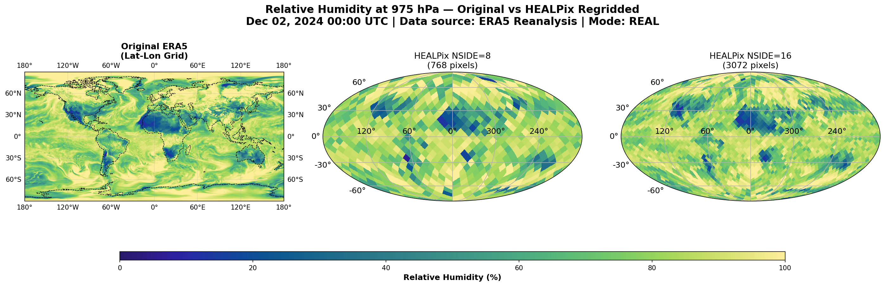

# ERA5 Data Processing Pipeline

**Author:** Yeganeh Khabbazian  
**Date:** January 2026

---

## Overview

This project implements an automated pipeline to download ERA5 climate reanalysis data from the Copernicus Climate Data Store, regrid it to HEALPix equal-area spheres, and store it efficiently in zarr format for time-series analysis.

**What the pipeline does:**

- **Downloads** daily ERA5 data (6-hourly timesteps) via the CDS API, with mock mode for testing
- **Interpolates** every timestep from lat-lon to HEALPix (NSIDE=8 for 768 pixels, NSIDE=16 for 3,072 pixels)
- **Appends immediately** to per-variable zarr stores as part of the daily processing chain
- **Archives** processed files under `archive/YYYY/MM/` after successful processing
- **Validates completeness** by checking zarr time entries before skipping a date

**Key design choices:**

- Mock and real files are kept separate (`data/mock/` vs `data/real/`) to avoid test/production interference
- If the configured variable name isn’t present in a file, the pipeline falls back to the first data variable it finds (for ERA5 this can be the short name `r`).
- Surface variables (no pressure-level dimension) are treated as a single implicit level
- All timestamps are normalized to UTC with `datetime64[ns]` precision
- The zarr base directory is resolved from the git project root (avoiding per-CWD duplicates) and lives at `zarr_data/` one level above `data_access/`
- Daily chunking aligns with the daily processing and completeness-checking workflow

---

## Dataset Information: ERA5

**ERA5** (ECMWF Reanalysis v5) is the state-of-the-art global climate reanalysis from the European Centre for Medium-Range Weather Forecasts. It blends observations (satellites, weather stations, aircraft) with model data via advanced data assimilation.

| Property | Details |
|---|---|
| **Spatial resolution** | ~31 km on regular latitude-longitude grid |
| **Temporal resolution** | Hourly; this pipeline uses 6-hourly (4 times per day) |
| **Variables** | 200+ including temperature, humidity, wind, pressure |
| **Pressure levels** | 37 levels from surface to stratosphere |
| **Coverage** | Global (0–360° longitude, −90–90° latitude) |
| **Data latency** | ~3 months behind real-time |

**Sources:**
- ECMWF ERA5: https://www.ecmwf.int/en/research/climate-reanalysis/era5
- CDS: https://cds.climate.copernicus.eu
- Hersbach et al. (2020): https://doi.org/10.1002/qj.3803

## Understanding HEALPix Grids

### What is HEALPix?

**HEALPix** is a genuinely curvilinear partition of the sphere into exactly equal-area quadrilaterals of varying shape. The base-resolution comprises twelve pixels in three rings around the poles and equator. The resolution of the grid is expressed by the parameter NSIDE, which defines the number of divisions along the side of a base-resolution pixel needed to reach a desired high-resolution partition. All pixel centers are placed on 4 × NSIDE − 1 rings of constant latitude and are equidistant in azimuth (on each ring).

*Source: Gorski et al. (2005), https://arxiv.org/pdf/astro-ph/9905275*

### Used Two Resolutions

The pipeline outputs NSIDE=8 and NSIDE=16:

| Resolution | NSIDE | Pixels | Area per Pixel |
|---|---|---|---|
| **Coarse** | 8 | 768 | ~827 km² |
| **Fine** | 16 | 3,072 | ~207 km² |

### Interpolation Method

Data is regridded from ERA5's regular lat-lon grid to HEALPix using linear interpolation via `scipy.griddata()`. To prevent artifacts at the 0°/360° dateline, where lon=359° and lon=1° are physically adjacent, I duplicate source points with lon±360° shifts. This allows the interpolator to correctly find neighbors across the dateline, eliminating seams in the HEALPix output.

---

## Getting Started

### Prerequisites

- **Python 3.10+**
- **Virtual environment** (venv recommended)
- **CDS API key** (only for real downloads)

### Installation

1. Create and activate a virtual environment.
2. Install dependencies from `requirements.txt`.
3. (Optional) Configure the CDS API for real downloads.

Detailed execution notes and examples live in the notebook markdown to avoid duplication.

### Quick Start: Mock Mode Test

No API setup required:

```bash
cd data_access
jupyter notebook era5_workflow.ipynb
```

In the notebook:
- Cell 3 has `MOCK_MODE = True` by default
- Run all cells 
- Pipeline completes in ~5 seconds with synthetic data
- Check results in `data/mock/`, `processed/mock/`, `archive/`, and `../zarr_data/`

---

## Notebook Usage

The notebook is configured entirely in **Cell 3** (User Parameters):

```python
MOCK_MODE = True                    # True = test, False = real CDS API
ERA5_CONFIG = {
    'variable': 'relative_humidity',
    'pressure_levels': [975, 900, 800, 500, 300],
    'times': ['00:00', '06:00', '12:00', '18:00'],
    'format': 'netcdf',
    'grid': None,                   # None = global; [N, W, S, E] = region
}
single_date = None                  # Set to process one date
start_date = None                   # Set for date range start
end_date = None                     # Set for date range end
```

**Invocation modes (automatic):**

| Configuration | Behavior |
|---|---|
| All `None` (default) | Runs the fixed default range (2024-12-01 to 2024-12-05), as required by the assignment |
| `single_date` set | Processes exactly one date |
| `start_date` & `end_date` set | Processes entire date range |


---

## Output Structure

```
data_access/
  ├── data/
  │   ├── mock/              # Test files (when MOCK_MODE=True)
  │   └── real/              # Real downloads (when MOCK_MODE=False)
  ├── processed/             # Processed copies before archiving
  │   ├── mock/
  │   └── real/
  ├── archive/               # Final files, organized by date
  │   ├── mock/YYYY/MM/
  │   └── real/YYYY/MM/
  └── (parent dir)
      └── zarr_data/         # HEALPix regridded data
          ├── mock/
          │   ├── relative_humidity_nside8.zarr
          │   └── relative_humidity_nside16.zarr
          └── real/
              ├── relative_humidity_nside8.zarr
              └── relative_humidity_nside16.zarr
```

The zarr stores contain:
- **data**: (time, pressure_level, healpix_pixel) array
- **time**: Timestamps as datetime64[ns]
- **pressure_level**: Pressure levels in hPa
- **attrs**: Metadata (nside, variable, pixel count)

---

## Testing & Validation
I first ran the notebook for a single date (01.12.2024).  
Next, I ran the notebook for 01–03 December to confirm that previously downloaded dates are skipped.  
Then I ran the notebook with no arguments and interrupted the download to confirm the pipeline detects download failures.  
I also interrupted the notebook while it was writing Zarr to confirm a rerun attempts the Zarr write again.  
For 01.12.2024, one day took about 25 minutes; I interrupted the internet for ~2 minutes, so the run would have been about 23 minutes without the interruption.  


### File Validation

Before reusing an existing downloaded file, the pipeline validates that it can be opened and contains expected coordinates (latitude/longitude). Invalid files are deleted and automatically re-downloaded on the next run.

---

## Design Decisions & Robustness

**1. Mock vs Real Separation**

Early testing revealed a critical issue: mock placeholder files would prevent real downloads when switching modes. I solved this by storing mock and real files in separate directories (`data/mock/` vs `data/real/`). This allows seamless testing and switching without manual file cleanup.

**2. Completeness Checking**

Simply checking if an archived file exists is insufficient; interrupted downloads leave partial data. I implemented `check_day_completeness()`, which verifies that all expected timesteps (e.g., 4 for 6-hourly data) exist in the zarr time coordinate before deciding to skip a date. This handles network interruptions gracefully: rerunning the pipeline automatically reprocesses incomplete days.

**3. Variable Name Fallback**

ERA5 uses short variable names (e.g., `r` for relative humidity) that don't always match the long names in `ERA5_CONFIG`. I added automatic detection: if the configured name is not found, the pipeline uses the first data variable with lat/lon dimensions. 

**4. Timestamp Precision**

Zarr time comparisons failed silently when numpy timestamps had different precisions. I now normalize all timestamps to `datetime64[ns]` before storage and comparison, ensuring reliable matching across runs.

**5. Pressure Level Integrity**

When a zarr store already exists, the pipeline verifies that incoming `pressure_levels` match the stored `pressure_level` metadata. If they differ, the write is rejected to prevent mixing incompatible datasets.

**6. Plot Consistency**

Comparison plots align the original ERA5 lat-lon data with the closest matching Zarr timestamp, so visual checks compare the same hour rather than neighboring timesteps.

**Colormaps**

I use cmocean because it is designed for geophysical fields and preserves meaningful visual gradients across the full range of values. Some palettes are reasonably robust to color‑vision differences, but not all are fully colorblind‑safe, so for maximum accessibility cividis or viridis can be substituted.

Example comparison plot (ERA5 lat‑lon vs HEALPix for 2024‑12‑02 00 UTC):



**7. Chunking Strategy**

Zarr arrays are stored as `(time, pressure_level, npix)` with time-based chunking so each chunk contains a full daily field. The current strategy is one day per chunk (4 timesteps/day), which matches the daily processing and completeness checks.

Trade-offs and alternatives:
- **Daily chunks (current)**: easy reprocessing of partial days; clean alignment with daily plots and checks.
- **Multi-day or monthly chunks**: fewer chunk files and less metadata overhead; better for long-range analytics but less convenient for day-level reruns.
- **Fixed timesteps per chunk**: decouples chunking from calendar boundaries and is more robust if the cadence changes in the future.

For NSIDE=8 and NSIDE=16, spatial chunking is unnecessary; keeping full spatial fields contiguous is more practical for this workflow.

Initially, I used 3-day chunks, but I switched to 1-day chunks because the workflow is organized around daily processing and it’s more convenient to access or reprocess a single day at a time.
---

## Reflections on Scalability and Limitations

Storage requirements scale linearly with the number of time steps, pressure levels, and HEALPix pixels. Using float32 data keeps storage manageable, but long time periods or higher spatial resolution would significantly increase disk usage.  
Daily chunking aligns well with the daily processing workflow and simplifies reprocessing of incomplete days. For long time spans, larger chunks (e.g., monthly) could reduce metadata overhead at the cost of reduced day-level flexibility.  
Processing time increases with the number of time steps, pressure levels, and especially with HEALPix resolution. Higher NSIDE values significantly increase interpolation cost, making resolution choice a key performance consideration.  
The dominant runtime cost is the spatial interpolation from latitude–longitude grids to HEALPix. For a single day, interpolation takes significantly longer than data download or file I/O.  

Limits to scaling include:  
- **API rate limits** that restrict request throughput.  
- **Network bandwidth** that bounds how fast daily files can be fetched.  
- **Local disk** space and filesystem overhead from many Zarr files.  

Possible improvements:  
- Interpolation performance could be improved by replacing repeated point-wise interpolation with vectorized or tree-based methods.  
- Interpolation could also be parallelized across timesteps or pressure levels to reduce wall-clock time.  
- Download time could be reduced by limited parallelization of daily requests, but it must respect API concurrency limits.  
- The download can target geographic subsets for region-focused studies, reducing both storage and processing cost.  
- Zarr stores create many small files; larger chunk sizes or compressed stores could improve I/O performance.

---

## References

1. Hersbach, H., Bell, B., Berrisfield, P., et al. (2020). The ERA5 global reanalysis. *Quarterly Journal of the Royal Meteorological Society*, 146(730), 1999–2049. https://doi.org/10.1002/qj.3803

2. Gorski, K. M., Hivon, E., Banday, A. J., et al. (2005). HEALPix: A framework for high-resolution discretization and fast analysis of data distributed on the sphere. *The Astrophysical Journal*, 622(2), 759–771. https://doi.org/10.1086/427976

3. ECMWF ERA5 Documentation. https://confluence.ecmwf.int/display/CKB/ERA5:+data+documentation

4. Zarr Specification. https://zarr-specs.readthedocs.io/

5. healpy Tutorial. https://healpy.readthedocs.io/en/latest/tutorial.html

---
